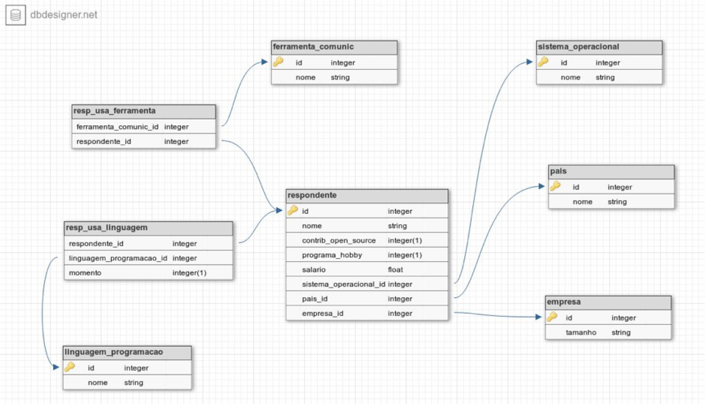
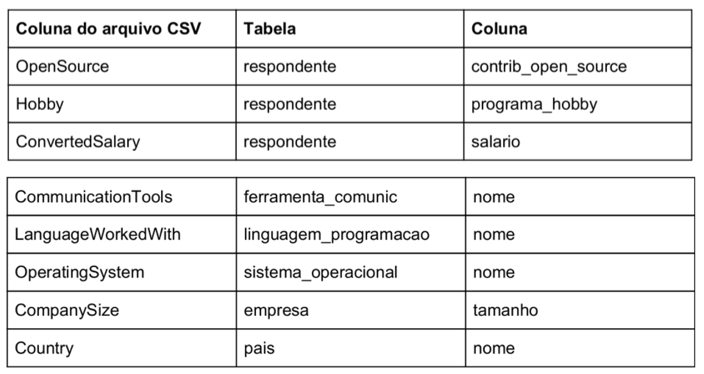

## Desafio Técnico para vaga de Engenheiro de Dados - Ciência do Consumo

### Introdução
Todo ano o Stack Overflow faz uma pesquisa com sua comunidade de desenvolvedores sobre vários temas, que vão desde as suas
preferências tecnológicas até questões profissionais. Seu desafio é nos ajudar a responder algumas perguntas usando os resultados de uma
destas pesquisas.

### Etapas
- **Popular um banco de dados a partir dos dados crus da pesquisa**:
Você deve usar Python para ler o arquivo, processá-lo de acordo com as regras de negócio descritas abaixo e depois inserir esses
dados em um banco de dados PostgreSQL.
**Regras do negócio**:
- Salário vazio ou com valor "NA" deve ser convertido para zero (0.0).
- Salário deve ser sempre calculado em reais e mensal. Para esse cálculo você usará a coluna ConvertedSalary, que contém o salário anual. Considere que 1 dólar equivale a R$5,6.
- O nome dos respondentes deve seguir a regra respondente_[número] . (ex: respondente_1, respondente_2, respondente_3). O critério de geração desse número é todo seu.
- Cada linha da tabela linguagem_programacao deve conter uma única linguagem de programação.
- Cada linha da tabela ferramenta_comunic deve conter apenas uma ferramenta de comunicação.
- É importante notar que em alguns campos de respostas existem múltiplos resultados, como por exemplo na coluna LanguageW orkedWith, que contém várias linguagens de programação em uma linha. Nestes casos, você deve quebrar a string nos pontos que existem ponto-e-vírgula (";").

Como resultado desta etapa deve ser entregue um arquivo chamado carga.py

---
- **Realizar consultas no banco de dados para responder as perguntas:**
  - Qual a quantidade de respondentes de cada país?
  - Quantos usuários que moram em "United States" gostam de Windows?
  - Qual a média de salário dos usuários que moram em Israel e gostam de Linux?
  - Qual a média e o desvio padrão do salário dos usuários que usam Slack para cada tamanho de empresa disponível?

Como resultado desta etapa deve ser entregue um Jupyter Notebook com as respostas.

### Modelo ER Banco de Dados 

### Lista de arquivos:
**Datasets**
- base_de_conhecimento.csv
- base_de_respostas_10k_amostra.csv
**Arquivos Python**
- sql_queries.py
Possui todas as queries necessárias para a criação do banco de dados 
- create_tables.py
Possui a lógica para fazer o DROP e CREATE das tabelas
- carga.py
Arquivo que faz o ETL dos dados e salva no banco de dados
**Arquivo Jupyter Notebook**
- Questions.ipynb
Arquivo que responde as perguntas do desafio

### Tecnologias utilizadas
As seguintes tecnologias foram usadas para a elaboração deste desafio:
- AWS Cloud9
- Python3
- Pyspark
- Postgres Rodando em Cloud em elephantsql.com
- Google Colab para criação do arquivos Questions.ipynb

### Instruções para execução
- python3 create_tables.py
- python3 carga.py
